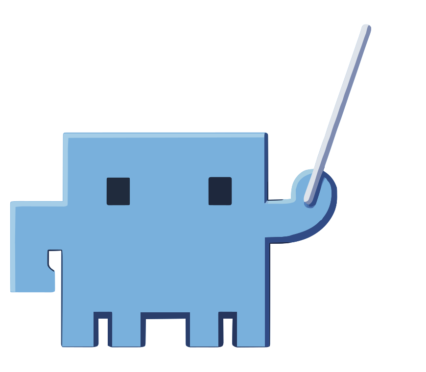
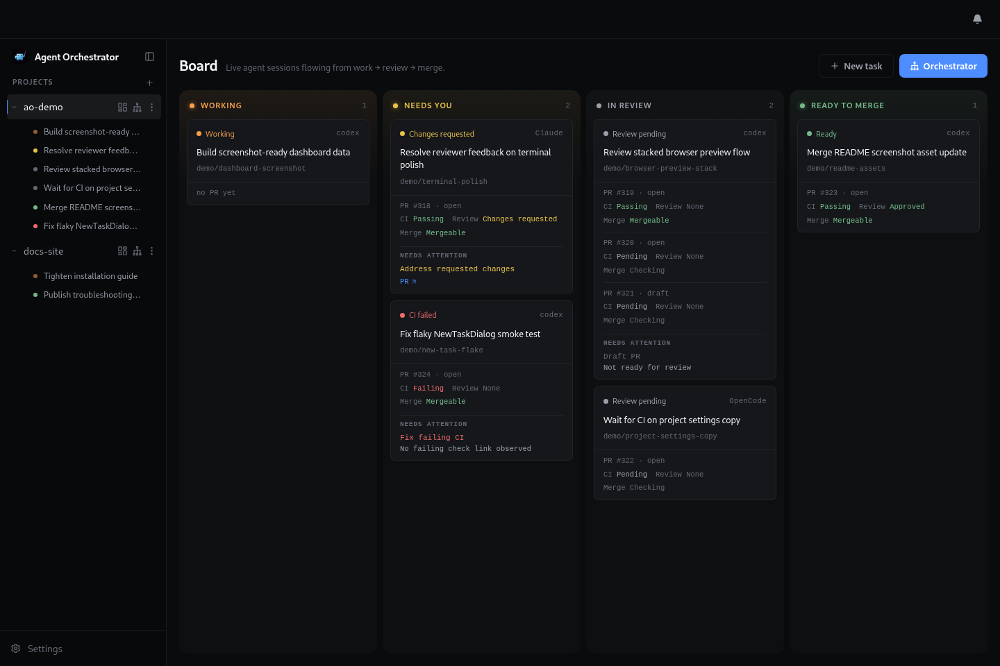
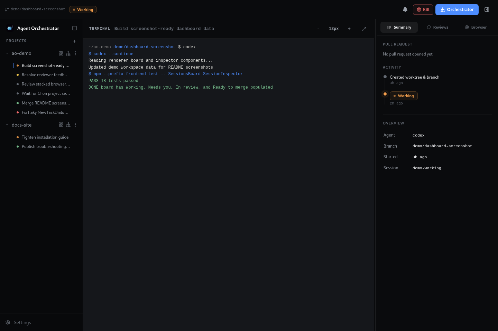
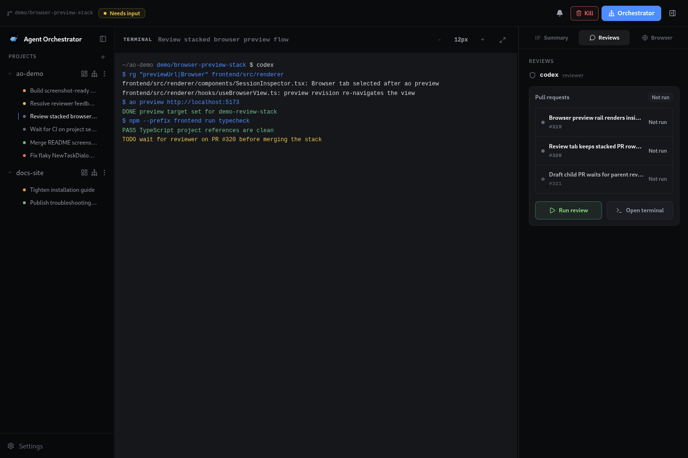
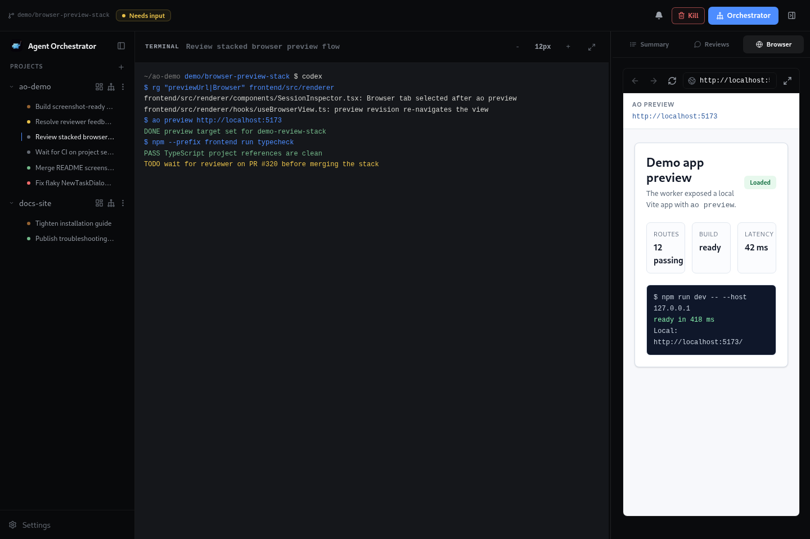

<div align="center">
  

# Agent Orchestrator

**The orchestration layer for parallel AI coding agents**

[](https://github.com/AgentWrapper/agent-orchestrator/stargazers)
[](https://github.com/AgentWrapper/agent-orchestrator/graphs/contributors)
[](https://x.com/aoagents)
[](https://discord.com/invite/UZv7JjxbwG)
[](LICENSE)

An Agentic IDE that supervises parallel AI coding agents in separate workspaces, with complete control and automatic feedback loops from CI failures, review comments, and merge conflicts.


</div>

---

## What is Agent Orchestrator?

Agent Orchestrator is a meta-harness agent IDE for running AI coding agents in parallel. It gives terminal-based agents like Claude Code, Codex, Cursor, Kimi Code, opencode, and others a shared workspace where their sessions, terminals, branches, pull requests, and feedback loops can be supervised from one place.

The agents still do the coding. AO provides the harness around them: separate workspaces, live terminal access, session state, PR awareness, and automatic loops that send CI failures, review comments, and merge conflicts back to the right agent. Instead of manually coordinating a pile of agent terminals, AO turns parallel agent work into a managed workflow.

## Why Agent Orchestrator?

AI coding agents become much more useful when they can work in parallel, but parallel work gets messy quickly. Branches overlap, terminals get lost, CI failures need follow-up, review comments need replies, and merge conflicts have to reach the right worker.

Agent Orchestrator is built to keep that loop visible and manageable. It helps you:

- Start multiple agents from the same project without mixing their work
- Keep coding sessions in separate git worktrees by default, with scratch and shared-directory workspaces for research, ops, and other non-git workloads
- See which agents are working, waiting, finished, or blocked
- Route CI failures, review comments, and merge conflicts back to the right session
- Use different agent CLIs through one common supervisor

## How it works

At a high level, Agent Orchestrator follows a simple loop:

1. Add a project you want agents to work on.
2. Start one or more sessions from the desktop app or CLI.
3. AO creates the session workspace: a dedicated git worktree by default, an ephemeral scratch directory, or the project's shared directory.
4. AO launches the selected coding agent in that session's terminal runtime.
5. The local daemon watches session state, terminal activity, pull requests, CI, and review feedback.
6. The desktop app and CLI show the current state and let you send follow-up instructions to the right session.

The result is a local control layer for agentic coding: agents still do the coding, while Agent Orchestrator keeps their workspaces, status, terminals, and feedback loops organized.

## Mission and Charter orchestration

Each project can choose how long its orchestrator should keep supervising work:

- **Mission** is the default, bounded mode: "complete this issue or defined set of work." The orchestrator works through that assignment and AO never schedules follow-up check-ins.
- **Charter** is the continuous mode: "keep working through this project's actionable backlog under its standing rules." It lets one existing orchestrator return to the issue queue after current work settles instead of ending supervision after a single assignment.

Charter is an idle reconciliation loop, not a daemon that blindly claims every open issue. At each configured interval:

1. AO waits until the project has exactly one live orchestrator and that orchestrator has genuinely reported idle.
2. AO sends that orchestrator a check-in; it does not create a new orchestrator or interrupt one that is active, blocked, or waiting on a decision.
3. The orchestrator refreshes durable project, session, issue-tracker, pull-request, CI, and review state.
4. The orchestrator applies the project's current rules. It can take the next unowned, actionable issue, coordinate workers, follow up on CI or review feedback, and then return to idle when that work is settled.
5. A later check-in repeats the process, allowing the project to keep chewing through real work over time.

If every remaining issue is assigned, deferred, dependency-blocked, awaiting human judgment, or otherwise outside the project's rules, the orchestrator stays idle. Charter does not invent work merely to remain busy, and pausing Charter does not stop already-running sessions.

The policy is stored per project and can be changed while AO is running. Select a project by id, or use `--current` from a registered project or AO session:

```bash
# Inspect the current project's policy.
ao project orchestration get --current

# Keep an idle orchestrator supervising this project every 30 minutes.
ao project orchestration set --current --mode charter --interval 30m

# Temporarily stop and later resume Charter check-ins.
ao project orchestration pause --current
ao project orchestration resume --current

# Return to a bounded assignment.
ao project orchestration set --current --mode mission
```

Charter intervals accept whole-minute durations from `1m` to `24h`. See the [CLI reference](docs/cli/README.md) for the complete command and project-selection behavior.

## Features

The desktop app is the main control surface: projects on the left, active sessions in the center, and the selected session's terminal, pull request state, review runs, and browser preview in the inspector.

<table>
  <tr>
    <td width="36%">
      <h3>Parallel agent sessions</h3>
      <p>Start multiple coding agents from the same project without mixing files, branches, terminals, or pull request state.</p>
    </td>
    <td width="64%">
      
    </td>
  </tr>
  <tr>
    <td width="36%">
      <h3>Live terminal control</h3>
      <p>Open any session and attach to the worker terminal while keeping session summary, PR state, and follow-up actions in view.</p>
    </td>
    <td width="64%">
      
    </td>
  </tr>
  <tr>
    <td width="36%">
      <h3>Review feedback loop</h3>
      <p>Run reviewer agents, inspect review status, and route requested changes back to the right worker session.</p>
    </td>
    <td width="64%">
      
    </td>
  </tr>
  <tr>
    <td width="36%">
      <h3>In-app browser preview</h3>
      <p>Preview a session's local app beside the terminal so UI work, browser state, and agent output stay together.</p>
    </td>
    <td width="64%">
      
    </td>
  </tr>
</table>

## Review convergence policy

Projects can opt into a limit for repeated low-priority automated review
feedback. Set `reviewPolicy.p2OnlyRoundLimit` to a value from `1` through `6`.
When that many most-recent completed review rounds are consecutively P2/P3-only,
AO stops forwarding another low-priority fix cycle and treats those remaining
automated suggestions as accepted by project policy.

This does not relax P0/P1 findings, untagged or ambiguous feedback, human review
requests, required CI, merge conflicts, mergeability, or merge authorization.
The default is disabled (`0` or omitted).

For an existing project, open **Project Settings → Reviewers → P2/P3 convergence
limit**, choose a limit such as **Stop after 3 P2/P3-only rounds**, and save. The
daemon applies the policy immediately. Because an orchestrator's standing prompt
is assembled when its session launches, the desktop replaces the active
orchestrator after this setting changes so the new session also receives the
policy in its standing instructions.

The setting is also available through the project config API and CLI.
`set-config` replaces the complete project config, so do not use the minimal
example below on a project that already has other settings without merging them
first:

```bash
ao project set-config <project-id> --config-json '{"reviewPolicy":{"p2OnlyRoundLimit":3}}'
```

When the project already has other settings, first inspect it with
`ao project get <project-id> --json`, merge
`reviewPolicy.p2OnlyRoundLimit` into the existing `config` object, and submit the
complete object. CLI/API updates are enforced live by the daemon but do not
rewrite an already-running orchestrator's system prompt. To keep that exact
thread instead of replacing it, notify it explicitly:

```bash
ao send --session <orchestrator-session-id> --message "Project reviewPolicy.p2OnlyRoundLimit is now 3. Re-read the live project config and apply that convergence policy."
```

## Supported Agents

AO ships adapters for 23 worker agent harnesses:

<p>
  <a href="https://ao-agents.com/docs/plugins/agents/claude-code"> <code>claude-code</code></a> ·
  <a href="https://ao-agents.com/docs/plugins/agents/codex"> <code>codex</code></a> ·
  <a href="https://ao-agents.com/docs/plugins/agents/aider"> <code>aider</code></a> ·
  <a href="https://ao-agents.com/docs/plugins/agents/opencode"> <code>opencode</code></a> ·
  <a href="https://ao-agents.com/docs/plugins/agents"> <code>grok</code></a> ·
  <a href="https://ao-agents.com/docs/plugins/agents"> <code>droid</code></a> ·
  <a href="https://ao-agents.com/docs/plugins/agents"><code>amp</code></a> ·
  <a href="https://ao-agents.com/docs/plugins/agents"><code>agy</code></a> ·
  <a href="https://ao-agents.com/docs/plugins/agents"> <code>crush</code></a> ·
  <a href="https://ao-agents.com/docs/plugins/agents/cursor"> <code>cursor</code></a> ·
  <a href="https://ao-agents.com/docs/plugins/agents"> <code>qwen</code></a> ·
  <a href="https://ao-agents.com/docs/plugins/agents"> <code>copilot</code></a> ·
  <a href="https://ao-agents.com/docs/plugins/agents"> <code>goose</code></a> ·
  <a href="https://ao-agents.com/docs/plugins/agents"><code>auggie</code></a> ·
  <a href="https://ao-agents.com/docs/plugins/agents"> <code>continue</code></a> ·
  <a href="https://ao-agents.com/docs/plugins/agents"> <code>devin</code></a> ·
  <a href="https://ao-agents.com/docs/plugins/agents"><code>cline</code></a> ·
  <a href="https://ao-agents.com/docs/plugins/agents"> <code>kimi</code></a> ·
  <a href="https://ao-agents.com/docs/plugins/agents"> <code>kiro</code></a> ·
  <a href="https://ao-agents.com/docs/plugins/agents"> <code>kilocode</code></a> ·
  <a href="https://ao-agents.com/docs/plugins/agents"> <code>vibe</code></a> ·
  <a href="https://ao-agents.com/docs/plugins/agents"> <code>pi</code></a> ·
  <a href="https://ao-agents.com/docs/plugins/agents"><code>autohand</code></a>
</p>

Reviewer agents are configured separately. The current reviewer harnesses are:

<p>
  <a href="https://ao-agents.com/docs/plugins/agents/claude-code"> <code>claude-code</code></a> ·
  <a href="https://ao-agents.com/docs/plugins/agents/codex"> <code>codex</code></a> ·
  <a href="https://ao-agents.com/docs/plugins/agents/opencode"> <code>opencode</code></a>
</p>

**If it runs in a terminal, it runs on Agent Orchestrator.**

## Install

Download the latest desktop build for your platform:

| Platform              | Download                                                                                                                      |
| --------------------- | ----------------------------------------------------------------------------------------------------------------------------- |
| macOS (Apple silicon) | [Download](https://github.com/AgentWrapper/agent-orchestrator/releases/latest/download/agent-orchestrator-darwin-arm64.zip)   |
| macOS (Intel)         | [Download](https://github.com/AgentWrapper/agent-orchestrator/releases/latest/download/agent-orchestrator-darwin-x64.zip)     |
| Windows               | [Download](https://github.com/AgentWrapper/agent-orchestrator/releases/latest/download/agent-orchestrator-win32-x64.exe)      |
| Linux                 | [Download](https://github.com/AgentWrapper/agent-orchestrator/releases/latest/download/agent-orchestrator-linux-x64.AppImage) |

After installing, open Agent Orchestrator and point it at the repository you want AO to manage. The desktop app runs the daemon for you, so no CLI is required. See the [installation guide](https://ao-agents.com/docs/installation) for agent CLI setup and troubleshooting.

<details>
<summary>Install via npm (legacy CLI, no longer recommended)</summary>

npm still works but is no longer recommended. The `@aoagents/ao` package is a bootstrap that launches the matching platform Go binary; the historical `@aoagents/ao-cli` package is the legacy TypeScript runtime. The bootstrap stays available for existing users who have `ao` on their PATH. For any new setup, prefer the desktop download.

```bash
npm install -g @aoagents/ao
ao start
```

</details>

## Witness AO's Journey on X

<table>
  <tr>
    <td width="50%" align="center">
      <a href="https://x.com/agent_wrapper/status/2026329204405723180">
        
      </a>
    </td>
    <td width="50%" align="center">
      <a href="https://x.com/agent_wrapper/status/2025986105485733945">
        
      </a>
    </td>
  </tr>
</table>

## Documentation

| Document                                                                 | Start here when you need                                                                     |
| ------------------------------------------------------------------------ | -------------------------------------------------------------------------------------------- |
| [docs/architecture.md](docs/architecture.md)                             | Backend mental model, lifecycle, persistence, CDC, status derivation, and daemon boundaries. |
| [docs/backend-code-structure.md](docs/backend-code-structure.md)         | Package ownership and where each backend concern belongs.                                    |
| [docs/cli/README.md](docs/cli/README.md)                                 | CLI behavior and daemon route mapping.                                                       |
| [docs/worker-daemon-threat-model.md](docs/worker-daemon-threat-model.md) | Same-user worker/daemon trust boundary and hostile-worker scope decision.                    |
| [docs/STATUS.md](docs/STATUS.md)                                         | What currently ships on `main` and what remains in flight.                                   |
| [docs/stack.md](docs/stack.md)                                           | Library, runtime, and dependency decisions.                                                  |

## Telemetry

Agent Orchestrator's Electron renderer sends anonymous usage events to PostHog for reliability and product understanding, and PostHog session recording is enabled with local paths and local URLs redacted before transmission. Set `VITE_AO_POSTHOG_KEY` to an empty string before building to disable transmission. See [docs/telemetry.md](docs/telemetry.md).

## License

Apache License 2.0. See [LICENSE](LICENSE).
