# Backend Code Structure

This document describes package ownership for the Go backend. It defines where code belongs, how packages interact, and the architectural boundaries that keep the system maintainable.

## Table of Contents

- [Overview](#overview)
- [Architecture Layers](#architecture-layers)
- [Package-by-Package Ownership](#package-by-package-ownership)
- [Interface Placement Rules](#interface-placement-rules)
- [Import Graph](#import-graph)
- [Adding New Code](#adding-new-code)
- [Examples](#examples)

---

## Overview

The backend is a **layered hybrid** architecture with clear separation between core business logic and external concerns:

```mermaid
graph TB
    subgraph CLI["CLI Layer"]
        CLI[internal/cli]
    end

    subgraph HTTP["HTTP Layer"]
        HTTPD[internal/httpd]
    end

    subgraph Services["Service Layer"]
        Project[internal/service/project]
        Session[internal/service/session]
        PR[internal/service/pr]
        Review[internal/service/review]
    end

    subgraph Core["Core Layer"]
        SessionMgr[internal/session_manager]
        Lifecycle[internal/lifecycle]
        Observe[internal/observe/*]
    end

    subgraph Data["Data Layer"]
        Domain[internal/domain]
        Ports[internal/ports]
        Storage[internal/storage/sqlite]
        CDC[internal/cdc]
    end

    subgraph Infra["Infrastructure Layer"]
        Terminal[internal/terminal]
        Adapters[internal/adapters/*]
        Daemon[internal/daemon]
        Config[internal/config]
    end

    CLI -->|calls| HTTPD
    HTTPD -->|calls| Services
    Services -->|calls| Core
    Services -->|uses| Data
    Core -->|uses| Data
    Core -->|uses| Infra
    HTTPD -->|uses| Data

```

### Key Architectural Principles

1. **Domain stays pure** — No infrastructure dependencies
2. **Ports define contracts** — Interfaces consumed by core, implemented by adapters
3. **Services orchestrate** — Controller-facing use cases over core and data
4. **Adapters are leaves** — Implement ports, don't import core
5. **CLI/HTTP stay thin** — Just protocol handling, all logic in daemon

---

## Architecture Layers

### Layer Interactions

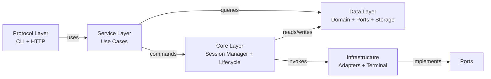

### Dependency Rules

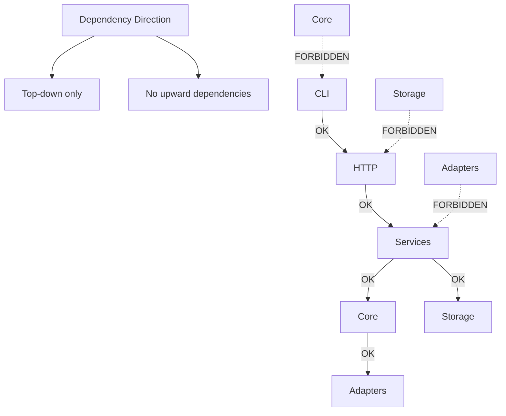

---

## Package-by-Package Ownership

### `internal/domain`

**Purpose:** Shared product vocabulary and durable fact records. The single source of truth for domain concepts.

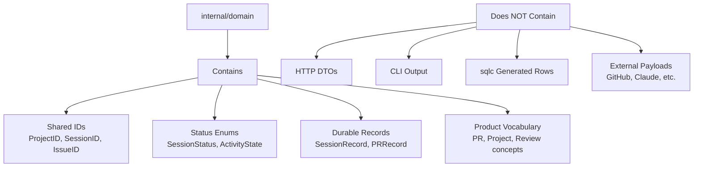

**Belongs here:**

- Shared IDs: `ProjectID`, `SessionID`, `IssueID`
- Enums and status vocabulary
- Durable fact records used across packages
- PR, tracker, project, session vocabulary

**Does NOT belong here:**

- HTTP request/response DTOs
- CLI output shapes
- OpenAPI wrapper types
- sqlc generated rows
- External system payloads (GitHub, tmux, agent-specific)

**Rule of thumb:** If AO would still use the concept after replacing HTTP, CLI, SQLite, GitHub, tmux, and every agent adapter, it belongs in domain.

---

### `internal/ports`

**Purpose:** Narrow capability interfaces that connect core code to replaceable external systems.

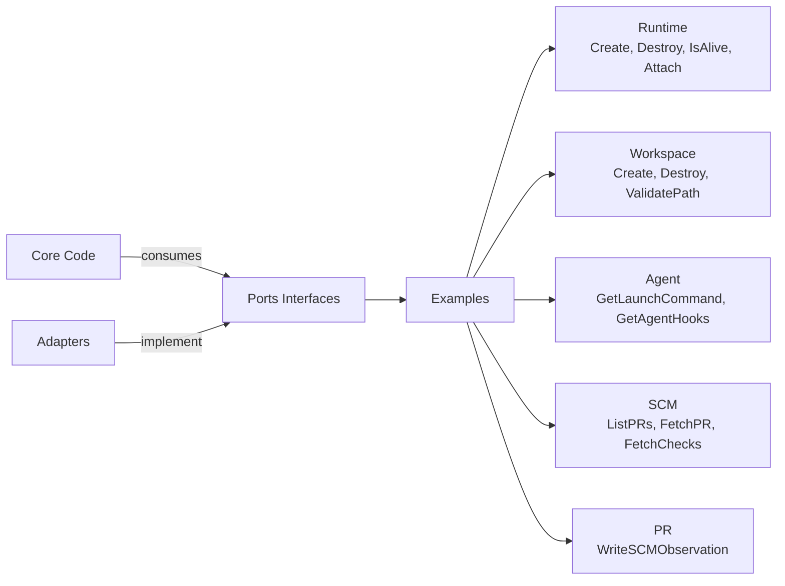

**Belongs here:**

- Interfaces consumed by core packages, implemented by adapters
- Capability structs: `RuntimeConfig`, `WorkspaceConfig`, `SpawnConfig`
- Vocabulary at the boundary between core and adapters

**Does NOT belong here:**

- Resource read models (belongs in `service/*`)
- HTTP request/response DTOs (belongs in `httpd`)
- sqlc rows (belongs in `storage/sqlite`)
- One-off internal interfaces

**Key Port Interfaces:**

| Port             | Purpose                 | Implementations         |
| ---------------- | ----------------------- | ----------------------- |
| `Runtime`        | Process isolation       | `tmux`, `conpty`        |
| `Workspace`      | Git worktree management | `gitworktree`           |
| `Agent`          | Agent launching         | 23+ agent adapters      |
| `SCM`            | PR/CI observation       | `github`                |
| `Tracker`        | Issue tracking          | `github` (adapter only) |
| `AgentMessenger` | Agent communication     | Agent hooks             |
| `PRWriter`       | PR persistence          | `pr.Manager`            |

---

### `internal/service/*`

**Purpose:** Controller-facing application boundary. Owns product use cases and read-model assembly.

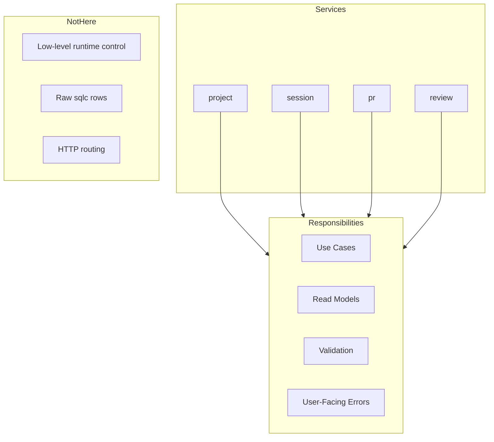

**Current service packages:**

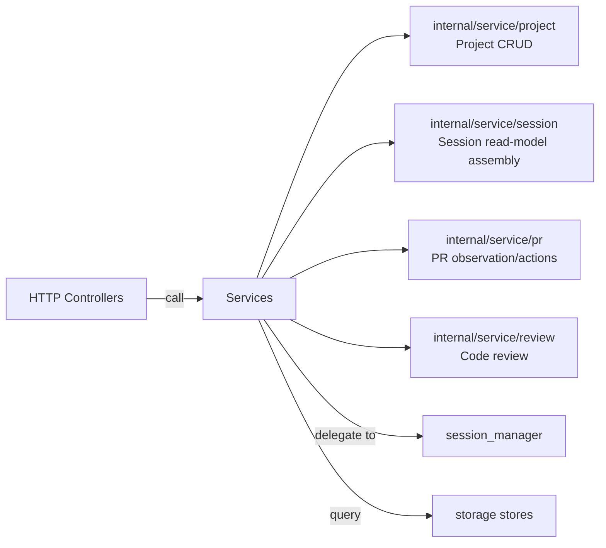

**Belongs here:**

- Resource use cases called by HTTP controllers and CLI
- Resource read models and command/result types
- Display-model assembly (e.g., session status derivation)
- Resource-specific validation and user-facing errors
- Small store interfaces consumed by the service

**Does NOT belong here:**

- Low-level runtime/workspace/agent process control
- Raw sqlc generated rows as public results
- HTTP routing, path parsing, status-code decisions
- Concrete external adapter details

**Example:** Project concepts live in `internal/service/project`, not in `domain` and not in `internal/project`.

---

### `internal/session_manager`

**Purpose:** Internal session command engine. Owns multi-step session mutations and resource orchestration.

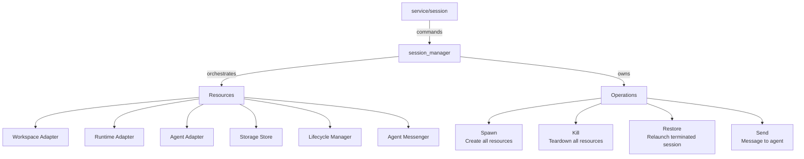

**Belongs here:**

- Multi-step session mutations with rollback
- Resource sequencing (workspace → runtime → agent)
- Resource teardown safety and cleanup
- Internal errors: not found, terminated, not restorable

**Does NOT belong here:**

- HTTP request decoding
- CLI formatting
- Controller-facing list/get read-model assembly
- Terminal WebSocket framing

**Intentional split:** `service/session` is the product/API boundary; `session_manager` is the internal command engine.

---

### `internal/lifecycle`

**Purpose:** Canonical write path for durable session lifecycle facts. Reduces observations into minimal persisted state.

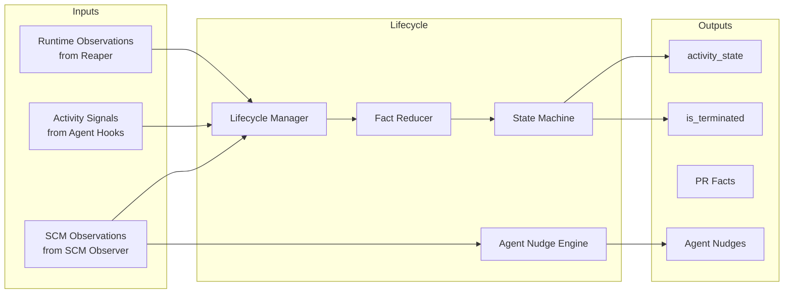

**Belongs here:**

- Updates to lifecycle-owned session facts
- Guardrails around runtime/activity observations
- Lifecycle-triggered agent nudges for actionable PR facts

**Does NOT belong here:**

- Display status persistence (use service layer instead)
- HTTP/CLI DTOs
- Direct adapter implementation details
- PR row persistence (use `pr.Manager`)

**Key invariant:** The UI status is derived at read time by service code. Do not store display status in lifecycle or SQLite.

---

### `internal/observe/*`

**Purpose:** Observation loops that poll external state and report facts to lifecycle.

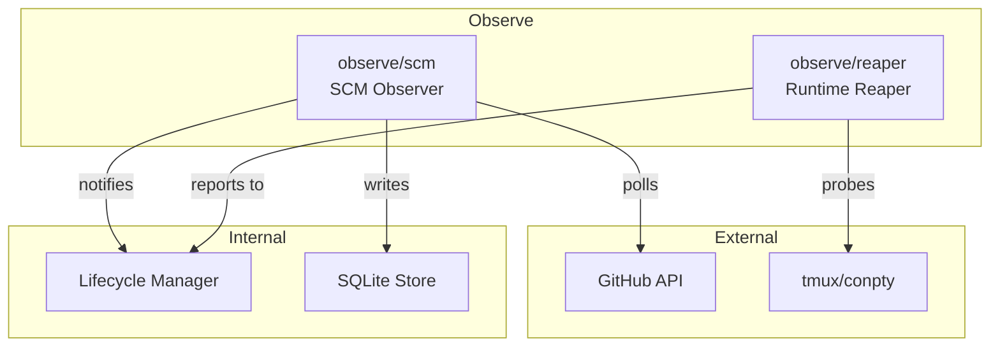

**Current observation packages:**

- `internal/observe/scm` — SCM (GitHub) observer loop
- `internal/observe/reaper` — Runtime liveness observation loop

**Belongs here:**

- Polling loops and observation logic
- External state transformation into domain facts
- Observation error handling and retry logic

**Does NOT belong here:**

- Product workflow decisions (belongs in service layer)
- Direct storage writes (use lifecycle instead)

---

### `internal/storage/sqlite`

**Purpose:** SQLite setup, migrations, queries, and store implementations.

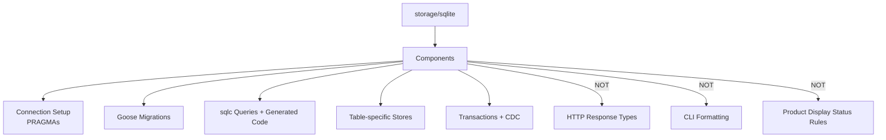

**Belongs here:**

- Connection setup and PRAGMAs
- Goose migrations
- sqlc queries and generated code
- Table-specific store methods
- Transactions and CDC-triggered persistence behavior

**Does NOT belong here:**

- HTTP response types
- CLI output formatting
- Product display status rules
- External adapter logic

**Rule:** Generated sqlc types should stay behind store methods. Services should work with domain records or service read models, not generated rows.

---

### `internal/cdc`

**Purpose:** Change-log polling and event broadcasting.

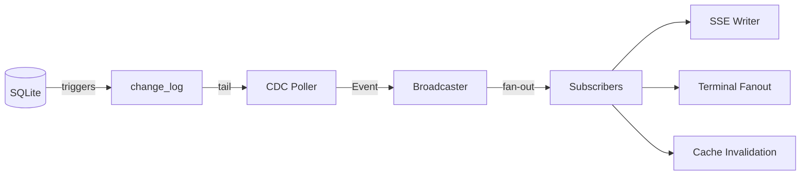

**Belongs here:**

- Event type definitions for the CDC stream
- Poller and broadcaster logic
- Subscriber fan-out behavior

**Does NOT belong here:**

- Terminal byte streams (belongs in `internal/terminal`)
- Product workflow decisions (belongs in service layer)
- Database schema ownership (belongs in `storage/sqlite`)

---

### `internal/terminal`

**Purpose:** Terminal session protocol and PTY attach management used by the HTTP terminal mux.

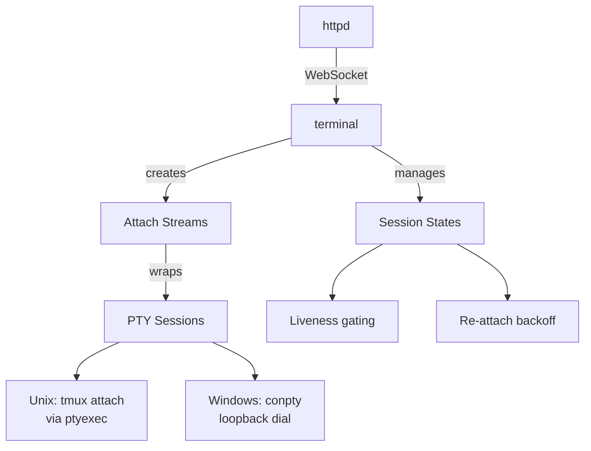

**Belongs here:**

- Per-client attachment lifecycle
- Input/output framing independent of HTTP
- PTY-backed attach handling and terminal protocol tests

**Does NOT belong here:**

- HTTP-specific concerns (belongs in `httpd`)
- HTTP routing or WebSocket upgrade logic

**Note:** `httpd` adapts WebSocket connections to terminal interfaces. `terminal` should not import `httpd`.

---

### `internal/httpd`

**Purpose:** HTTP protocol adapter. Handles routing, middleware, and request/response encoding.

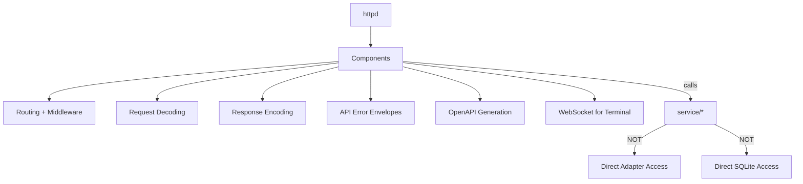

**Belongs here:**

- Routing and middleware
- HTTP request decoding and response encoding
- Path/query parameter handling
- Status-code mapping
- API error envelopes
- OpenAPI generation and serving
- WebSocket upgrade handling for terminal mux

**Does NOT belong here:**

- Direct adapter or SQLite store access
- Application read models shared with CLI (belongs in `service/*`)

**Rule:** Controllers call service managers and translate service results/errors into HTTP responses.

---

### `internal/cli`

**Purpose:** User-facing `ao` command. Thin client over the daemon HTTP API.

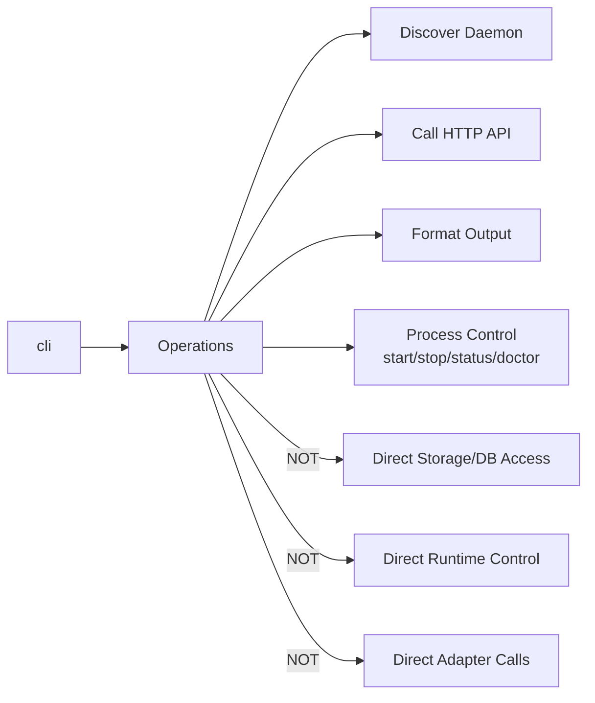

**Belongs here:**

- Daemon discovery
- HTTP API calls
- Command output formatting
- Process control: start/stop/status/doctor

**Does NOT belong here:**

- Duplicate daemon business logic (put in daemon service/API)
- Direct storage, runtime, or adapter access

**Rule:** If a command needs product behavior, put it in the daemon and have the CLI call that API path.

---

### `internal/adapters/*`

**Purpose:** Concrete implementations of ports interfaces. Wraps external systems.

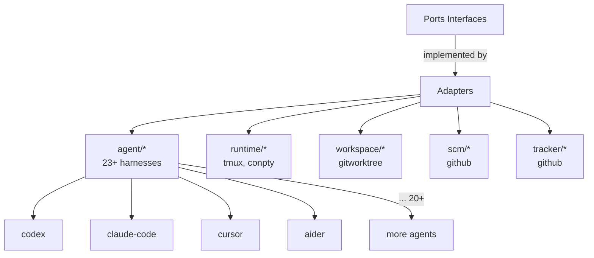

**Adapter principles:**

- Adapters are leaves in the import graph
- Adapters translate external behavior into AO ports/domain concepts
- Adapters should not own product workflows
- All adapter-written files must be gitignored

**Good dependencies:**

```
session_manager → ports.Runtime
adapters/runtime/tmux → ports + domain
adapters/workspace/gitworktree → ports + domain
daemon → adapters + services + storage
```

**Avoid:**

```
domain → adapters
service/session → adapters/runtime/tmux
httpd/controllers → storage/sqlite/store
adapters/* → httpd
```

---

### `internal/daemon`

**Purpose:** Production composition root. Wires all dependencies together.

```mermaid
graph TD
    Daemon[daemon] --> Responsibilities[Responsibilities]

    Responsibilities --> Wire[Dependency Construction]
    Responsibilities --> Register[Adapter Registration]
    Responsibilities --> Startup[Startup Sequencing]
    Responsibilities --> Shutdown[Shutdown Sequencing]
    Responsibilities --> Cross[Cross-component Wiring]

    Responsibilities -->|NOT| Business[Business Logic<br/>(put in service/lifecycle)]
    Responsibilities -->|NOT| Adapter[Adapter Implementation<br/>(put in adapters/*)]

```

**Belongs here:**

- Production dependency construction
- Adapter registration
- Startup/shutdown sequencing
- Cross-component wiring

**Does NOT belong here:**

- Business logic (belongs in service, lifecycle, or manager packages)
- Adapter implementation details (belongs in adapters/\*)

---

### `internal/config`

**Purpose:** Environment-based daemon configuration.

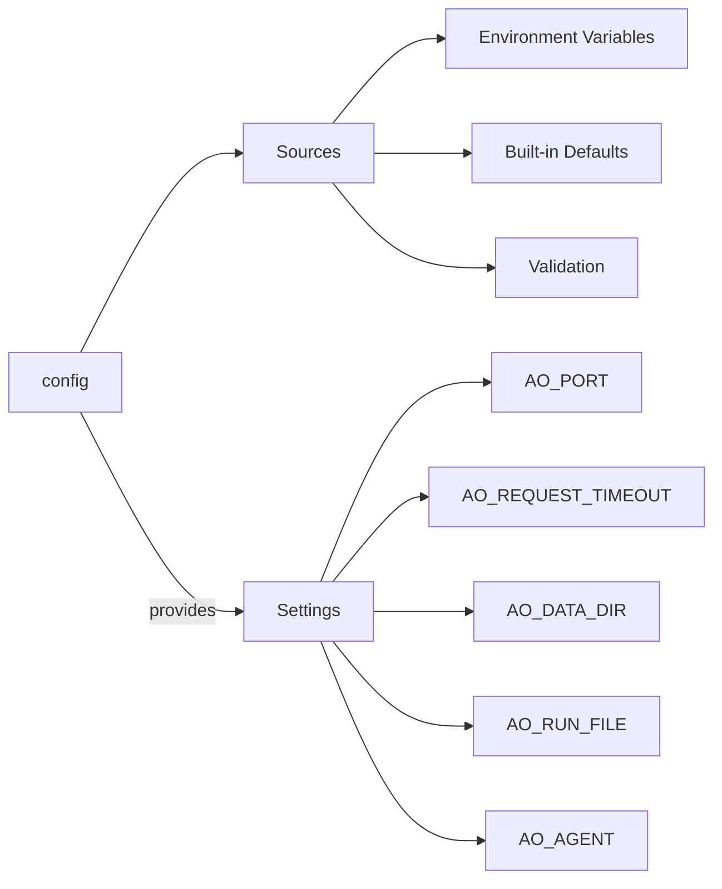

**Key environment variables:**

- `AO_PORT` — HTTP bind port (default: 3001)
- `AO_REQUEST_TIMEOUT` — Per-request timeout (default: 60s)
- `AO_SHUTDOWN_TIMEOUT` — Graceful shutdown cap (default: 10s)
- `AO_RUN_FILE` — PID/port handshake (default: ~/.ao/running.json)
- `AO_DATA_DIR` — SQLite data directory (default: ~/.ao/data)
- `AO_AGENT` — Compatibility agent adapter (default: claude-code)
- `GITHUB_TOKEN` — GitHub authentication

---

## Interface Placement Rules

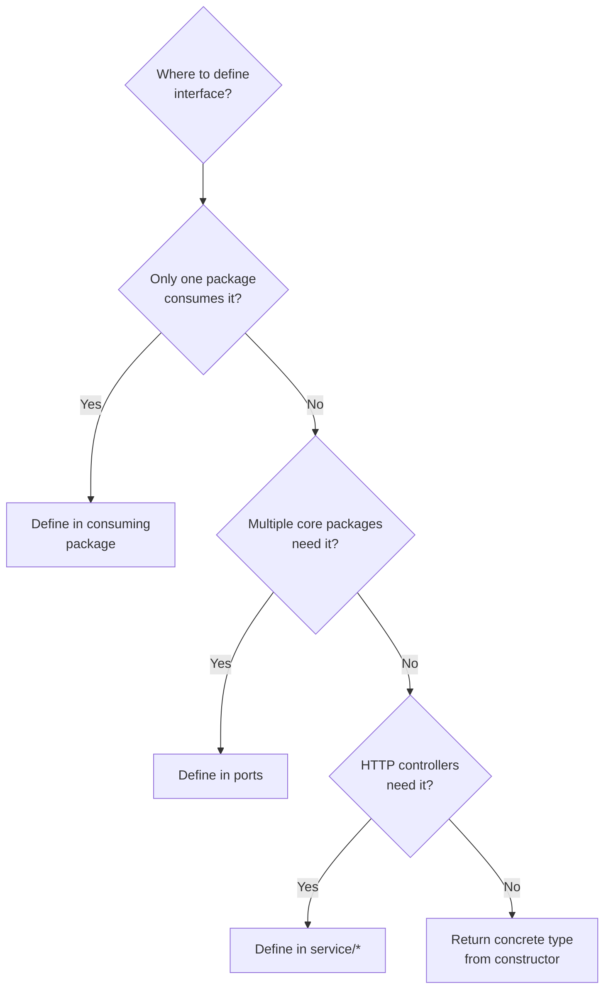

**Rules:**

1. **Single consumer** → Define in the consuming package (smallest interface)
2. **Multiple core consumers** → Define in `ports` (shared capability)
3. **HTTP controllers need resource** → Use `service/*` manager interface
4. **Return from constructor** → Return concrete type unless genuinely needed

**Examples:**

```go
// Good: Interface near single consumer
type sessionGetter interface {
    GetSession(ctx context.Context, id SessionID) (SessionRecord, bool, error)
}

// Good: Shared capability in ports
type Runtime interface {
    Create(ctx context.Context, cfg RuntimeConfig) (RuntimeHandle, error)
    Destroy(ctx context.Context, handle RuntimeHandle) error
    IsAlive(ctx context.Context, handle RuntimeHandle) (bool, error)
}

// Good: Service interface for controllers
type Manager interface {
    List(ctx context.Context) ([]Project, error)
    Add(ctx context.Context, cfg Config) (Project, error)
    Remove(ctx context.Context, id string) error
}
```

---

## Import Graph

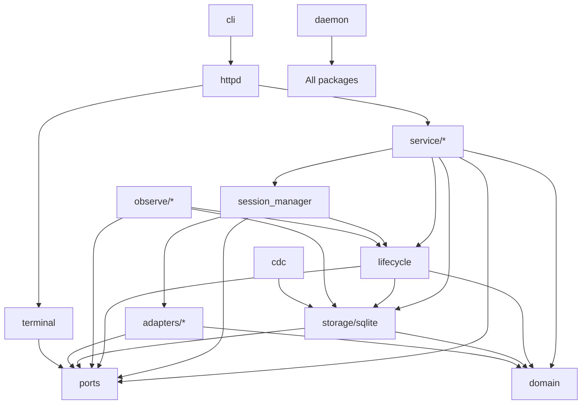

**Key patterns:**

- All arrows point downward (no cycles)
- Adapters and domain are leaves
- CLI and HTTPD don't touch storage directly
- Everything depends on ports and domain

---

## Adding New Code

### New HTTP Route

```mermaid
flowchart LR
    AddRoute[Add HTTP Route] --> Route[Register in httpd]
    Route --> Call[Call service/*]
    Call --> Update[Update OpenAPI]
    Update --> Test[Add tests]

```

**Steps:**

1. Add controller in `httpd/controllers/`
2. Call a `service/*` package
3. Update OpenAPI generation
4. Add spec tests

### New Product Resource

```mermaid
flowchart TD
    NewResource[New Resource] --> Domain[Add IDs/vocab to domain]
    Domain --> Service[Create service/resource]
    Service --> Storage[Add storage queries]
    Storage --> Ports[Add ports if needed]
    Ports --> Adapter[Implement adapter if needed]

```

**Steps:**

1. Add shared IDs/vocabulary to `domain`
2. Create use cases in `service/<resource>`
3. Add storage in `storage/sqlite`
4. Add ports if external system needed
5. Implement adapter in `adapters/<capability>/<impl>`
6. Wire in `daemon`

### New Adapter

```mermaid
flowchart LR
    NewAdapter[New Adapter] --> Port[Implement port interface]
    Port --> Hooks[Implement hooks if agent]
    Hooks --> Gitignore[Add .gitignore entries]
    Gitignore --> Wire[Wire in daemon]
    Wire --> Test[Add conformance tests]

```

**Steps:**

1. Implement a `ports` interface under `adapters/<capability>/<impl>`
2. For agents: implement hooks with gitignored files
3. Wire in `daemon`
4. Add conformance tests

---

## Examples

### Example: Adding a Session Command

```go
// In internal/service/session/service.go
func (s *Service) MyNewCommand(ctx context.Context, id SessionID) (Result, error) {
    // 1. Validate input
    // 2. Call session_manager
    // 3. Enrich result
    // 4. Return read model
}

// In internal/httpd/controllers/sessions.go
func (c *SessionsController) myNewCommand(w http.ResponseWriter, r *http.Request) {
    // 1. Decode request
    // 2. Call service
    // 3. Encode response
}
```

### Example: Adding a Port Interface

```go
// In internal/ports/myfeature.go
package ports

type MyFeature interface {
    DoSomething(ctx context.Context, cfg Config) (Result, error)
}

// In internal/adapters/myfeature/impl.go
package impl

import "github.com/aoagents/agent-orchestrator/backend/internal/ports"

type Impl struct { ... }

func (i *Impl) DoSomething(ctx context.Context, cfg ports.Config) (ports.Result, error) {
    // Implementation
}
```

### Example: Service Layer Pattern

```go
// In internal/service/myresource/service.go
package service

// Service is the controller-facing boundary
type Service struct {
    manager *manager.Manager  // Internal command engine
    store   Store             // Storage interface
}

// New constructs the service
func New(mgr *manager.Manager, store Store) *Service {
    return &Service{manager: mgr, store: store}
}

// List returns enriched read models
func (s *Service) List(ctx context.Context) ([]MyResource, error) {
    records, err := s.store.List(ctx)
    if err != nil {
        return nil, err
    }
    return s.enrich(records), nil
}

// Create performs a use case
func (s *Service) Create(ctx context.Context, cfg Config) (MyResource, error) {
    // Business logic
    result, err := s.manager.Create(ctx, cfg)
    if err != nil {
        return MyResource{}, err
    }
    return s.enrichOne(result), nil
}
```

---

## Summary

**Key takeaways:**

1. **Domain** stays pure — shared vocabulary only
2. **Ports** define contracts — interfaces for external systems
3. **Services** orchestrate — controller-facing use cases
4. **Adapters** are leaves — implement ports, no core imports
5. **CLI/HTTP** stay thin — protocol handling only
6. **Daemon** wires it all — composition root

**Always ask:**

- Does this belong in domain (shared concept)?
- Does this belong in ports (shared capability)?
- Does this belong in service (use case)?
- Does this belong in adapters (external system)?

**Never:**

- Put HTTP types in domain
- Put display status in storage
- Put business logic in CLI
- Import core from adapters
- Import adapters from services
